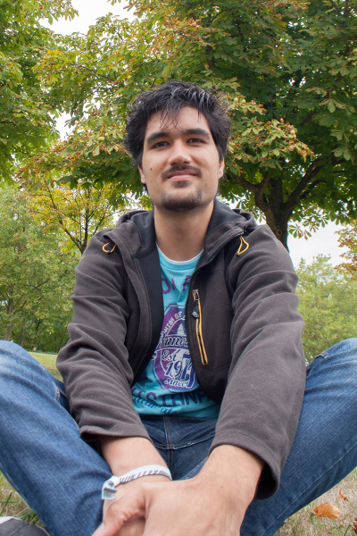

Hi, I'm Jonathan Giroux and this is my porfolio. I'm a Digital Media Artist and Software Engineer based in Paris, France.

With a technical education, I turned into digital media art. Now I design and develop playful experiences, real-time animations, and open-source libraries. I regularly participate to game jams, demoparties, and experimental game festivals where I sometimes exhibit my latest works.

I currently work for Ubisoft, and occasionally as freelancer. I'm a member of [Alineaire (artistic game collective)](http://www.alineaire.fr/) and [tmp (demoscene group)](http://tmp.graphics/).

