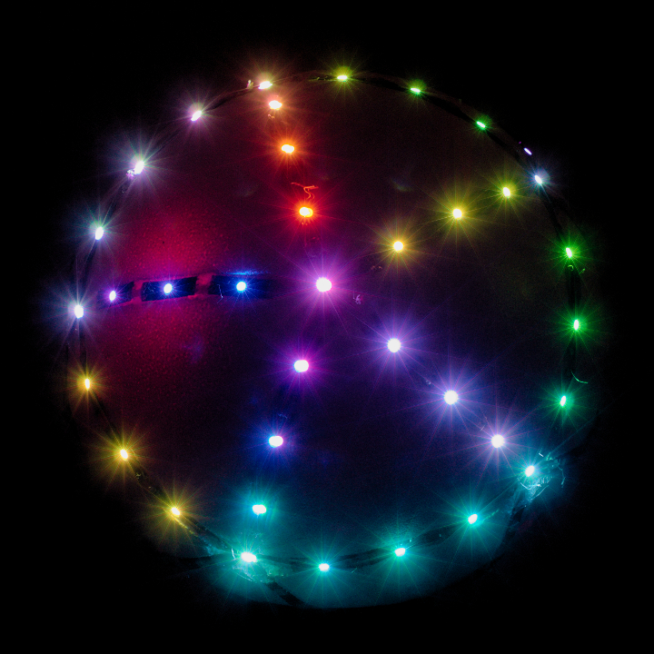

[Dedicated website on *livingorb.io*](http://livingorb.io "button")

*Living Orb* is a tangible game console. Play by rotating it in your hands. The screen is its surface, composed of leds all around. Games are shared on Internet and can be downloaded to the device. Both hardware and software are open-source, so everybody can construct their own.

Presented game in the video above: *Falling Light*, where a light tries to fall down, while the player rotates the orb in order to keep the light on the top.

In the video above, the game is not interactive and only consists of a chaser effect, as a decoration for the concert.

