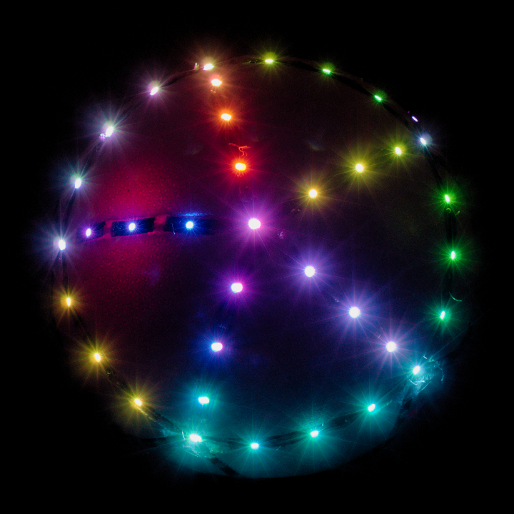

Orb is a physical game console. Play by rotating it in your hands. The screen is its surface, composed of leds all around.

Presented game in the video above: A light tries to go down, while the player rotates the orb in order to keep the light on the top.

