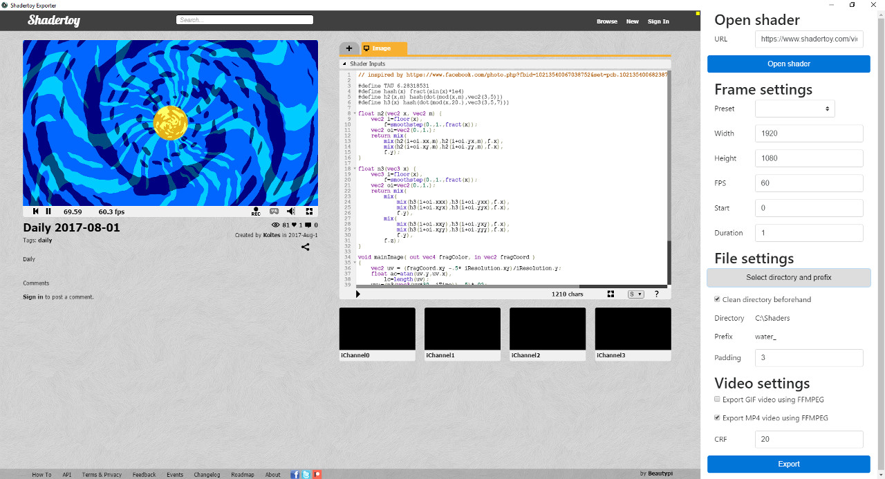

Export images and videos from Shadertoy.

Features:

- Fully support Shadertoy as it is embedded in a web view.
- Saves frames directly as PNG images.
- Can generate GIF and MP4 videos using the image sequence.
- Configurable, persisting settings: resolution, FPS, filenames...
- If the clipboard contains a shader URL at startup, opens it directly.

[Download the application for Windows, Mac OS X, and Linux.](https://github.com/KoltesDigital/shadertoy-exporter/releases "button")

[Repository on *GitHub*](https://github.com/KoltesDigital/shadertoy-exporter "button")
